# Comprehensive System Flow Diagram

This diagram provides a complete end-to-end view of the WHOOP Extended application, combining user interactions, frontend logic, API calls, backend processing, and data transformations in a single comprehensive flow.

```mermaid
graph TB
    subgraph "Frontend - User Interface"
        A["Landing Page<br/>App.tsx"] --> B["Upload Page<br/>Upload.tsx"]
        B --> C{"User Action"}
        C -->|Upload File| D["Select CSV<br/>physiological_cycles.csv"]
        C -->|Use Demo| E["Demo Data"]
        
        D --> F["POST /api/upload<br/>FormData"]
        E --> G["GET /api/demo"]
    end
    
    subgraph "Backend - File Handling"
        F --> H["File Validation<br/>.csv, .xlsx, .xls"]
        G --> I["Demo File Reference<br/>demo_whoop_data"]
        H --> J["UUID Generation<br/>abc123-def456"]
        I --> J
        J --> K["File Storage<br/>uploads/{uuid}.csv"]
    end
    
    subgraph "Frontend - Session Management"
        K --> L["Return file_id<br/>JSON Response"]
        L --> M["localStorage.setItem<br/>('fileId', uuid)"]
        M --> N["Generate Analysis Button<br/>User Clicks"]
    end
    
    subgraph "Backend - ML Pipeline Initialization"
        N --> O["POST /api/analyze/model/{id}<br/>Trigger ML Pipeline"]
        O --> P["Load CSV Data<br/>pd.read_csv()"]
        P --> Q["Data Preprocessing<br/>preprocess_data()"]
    end
    
    subgraph "Data Processing Pipeline"
        Q --> R["Quality Filters<br/>Remove missing sleep efficiency"]
        R --> S["Duration Filter<br/>≥ 5 hours sleep"]
        S --> T["Feature Engineering<br/>Sleep stage ratios"]
        T --> U["Data Cleaning<br/>Remove timestamps"]
        U --> V["Missing Value Imputation<br/>Median fill"]
    end
    
    subgraph "Machine Learning Training"
        V --> W["Feature Preparation<br/>model_prep()"]
        W --> X["Target Definition<br/>Recovery Score %"]
        X --> Y["XGBoost Training<br/>5-fold CV + Early Stopping"]
        Y --> Z["Trained Model<br/>XGBRegressor"]
    end
    
    subgraph "Analysis Generation"
        Z --> AA["Calculate Insights<br/>Top 3 features impact"]
        Z --> BB["Equivalence Analysis<br/>Feature relationships"]
        Z --> CC["SHAP Analysis<br/>Model interpretability"]
    end
    
    subgraph "Backend - Caching System"
        AA --> DD["In-Memory Cache<br/>cache[file_id]"]
        BB --> DD
        CC --> DD
        Z --> DD
        DD --> EE["Cached Data Structure<br/>{model, insights, eq_insights, shap}"]
    end
    
    subgraph "Frontend - Dashboard Navigation"
        EE --> FF["Success Response<br/>ML Pipeline Complete"]
        FF --> GG["localStorage.setItem<br/>('insightsReady', 'true')"]
        GG --> HH["navigate('/dashboard')<br/>React Router"]
    end
    
    subgraph "Dashboard Page - Data Loading"
        HH --> II["Dashboard.tsx<br/>Component Mount"]
        II --> JJ["Navigation Guard<br/>Check localStorage"]
        JJ --> KK["Parallel API Calls<br/>3 simultaneous requests"]
        
        KK --> LL["GET /api/analyze/insights/{id}"]
        KK --> MM["GET /api/analyze/eqInsights/{id}"]
        KK --> NN["GET /api/analyze/shap/{id}"]
    end
    
    subgraph "Backend - Data Serving"
        LL --> OO["Return Insights<br/>cache[file_id]['insights']"]
        MM --> PP["Return Equivalencies<br/>cache[file_id]['equivalence_insights']"]
        NN --> QQ["Return SHAP Data<br/>cache[file_id]['shap_values']"]
    end
    
    subgraph "Frontend - State Management"
        OO --> RR["setInsights(data)<br/>React State"]
        PP --> SS["setEqInsights(data)<br/>React State"]
        QQ --> TT["setShapData(data)<br/>React State"]
        
        RR --> UU["Dashboard UI Render<br/>Three-tab interface"]
        SS --> UU
        TT --> UU
    end
    
    subgraph "User Interface Modules"
        UU --> VV{"Tab Selection"}
        VV -->|Insights| WW["InsightsModule<br/>Carousel + Cards"]
        VV -->|Feature Analysis| XX["ShapModule<br/>Bar Charts + Waterfall"]
        VV -->|Simulate| YY["PredictionModule<br/>13 Biometric Sliders"]
    end
    
    subgraph "Real-time Prediction Flow"
        YY --> ZZ["User Adjusts Sliders<br/>HRV, RHR, Sleep metrics"]
        ZZ --> AAA["POST /api/analyze/predict/{id}<br/>JSON payload with 13 values"]
        AAA --> BBB["Backend Processing<br/>final_prediction()"]
        BBB --> CCC["Feature Derivation<br/>Calculate ratios & efficiency"]
        CCC --> DDD["Model Prediction<br/>Use cached XGBoost model"]
        DDD --> EEE["Return Score<br/>Predicted recovery %"]
        EEE --> FFF["Display Result<br/>Update UI with prediction"]
    end
    
    subgraph "Session Reset Flow"
        UU --> GGG["Reset Button<br/>Analyze New File"]
        GGG --> HHH["localStorage.clear()<br/>Remove fileId & insightsReady"]
        HHH --> B
    end
    
    %% Styling
    style A fill:#e1f5fe
    style B fill:#fff3e0
    style Z fill:#e8f5e8
    style DD fill:#fff3e0
    style UU fill:#e8f5e8
    style WW fill:#f3e5f5
    style XX fill:#f3e5f5
    style YY fill:#f3e5f5
    style FFF fill:#c8e6c9
```

## System Architecture Overview

### 1. Frontend Architecture (React + TypeScript)
- **Landing Page**: Simple welcome interface with navigation
- **Upload Page**: File handling with demo data support
- **Dashboard**: Three-tab analysis interface with real-time interactions
- **State Management**: localStorage for session persistence + React hooks

### 2. Backend Architecture (Flask + ML)
- **File Handling**: UUID-based storage with validation
- **ML Pipeline**: XGBoost training with comprehensive preprocessing
- **Caching System**: In-memory storage for fast API responses
- **Analysis Engine**: Insights generation + SHAP interpretability

### 3. Data Processing Pipeline
- **Raw Data**: WHOOP physiological cycles CSV
- **Preprocessing**: Quality filters + feature engineering
- **Model Training**: 5-fold cross-validation with early stopping
- **Analysis**: Multi-dimensional insights generation

### 4. API Integration Layer
- **File Operations**: Upload and demo data endpoints
- **ML Operations**: Model training and analysis generation
- **Data Retrieval**: Cached insights, SHAP, and equivalencies
- **Real-time Processing**: Live predictions with custom inputs

## Key System Characteristics

### 🔄 **Session Flow**
1. **File Upload** → UUID generation → localStorage storage
2. **Analysis Generation** → ML training → cache population
3. **Dashboard Access** → parallel data loading → UI rendering
4. **Interactive Prediction** → real-time model inference

### 💾 **Data Management**
- **Client-side**: Minimal localStorage (fileId, insightsReady)
- **Server-side**: In-memory caching with complete analysis results
- **File Storage**: Local uploads directory with UUID naming

### 🚀 **Performance Optimizations**
- **Parallel API calls** for dashboard data loading
- **In-memory caching** eliminates repeated ML training
- **Early stopping** in XGBoost training
- **Progressive enhancement** with graceful error handling

### 🔒 **Session Management**
- **Navigation guards** prevent unauthorized access
- **Automatic redirects** based on session state
- **Reset functionality** for new analysis workflows

This comprehensive diagram shows how user actions trigger data processing workflows, how the ML pipeline transforms raw data into actionable insights, and how the frontend seamlessly presents complex analysis results through an intuitive interface. 