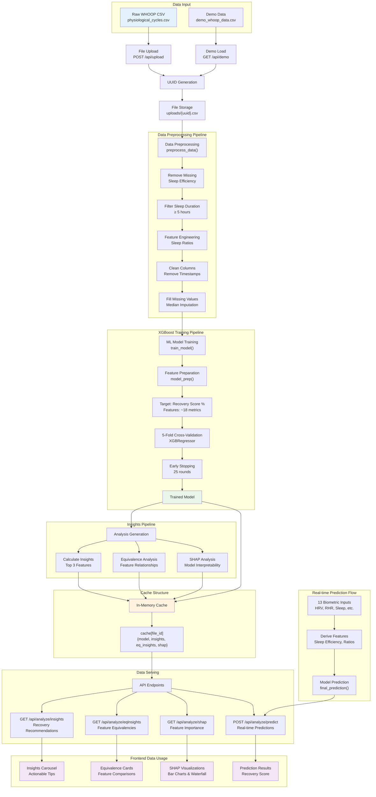

# Data Flow Diagram

This diagram illustrates how data flows through the WHOOP Extended system, from raw CSV input through machine learning processing to final insights and predictions.

## Data Processing Stages

### 1. Data Ingestion
- **Raw CSV**: WHOOP physiological cycles data with ~18 features
- **File Management**: UUID-based storage system
- **Demo Support**: Pre-loaded sample dataset

### 2. Data Preprocessing
- **Quality Filters**: Remove incomplete records (missing sleep efficiency)
- **Duration Filter**: Only analyze nights with ≥5 hours of sleep
- **Feature Engineering**: Calculate sleep stage ratios (Deep/REM/Light)
- **Data Cleaning**: Remove timestamps and irrelevant columns
- **Missing Value Handling**: Median imputation for numeric features

### 3. Machine Learning Pipeline
- **Model Type**: XGBoost Regressor for continuous predictions
- **Validation**: 5-fold cross-validation with early stopping
- **Target Variable**: Recovery Score % (0-100)
- **Features**: Biometric data + engineered sleep ratios

### 4. Analysis Generation
- **Insights**: Impact analysis of top 3 features (HRV, RHR, REM)
- **Equivalencies**: Cross-feature relationships and trade-offs
- **Interpretability**: SHAP values for model explanation

### 5. Data Serving
- **Caching Strategy**: In-memory storage for fast access
- **API Endpoints**: RESTful services for different data types
- **Real-time Processing**: Live predictions with custom inputs

## Key Data Transformations

| Stage | Input | Output | Purpose |
|-------|-------|--------|---------|
| **Upload** | Raw CSV | File ID | Session management |
| **Preprocessing** | Raw data | Clean DataFrame | Model-ready data |
| **Training** | Features + Target | XGBoost Model | Prediction capability |
| **Analysis** | Model + Data | Insights + SHAP | User understanding |
| **Caching** | All results | In-memory store | Fast API responses |
| **Prediction** | Custom inputs | Recovery score | Real-time simulation | 