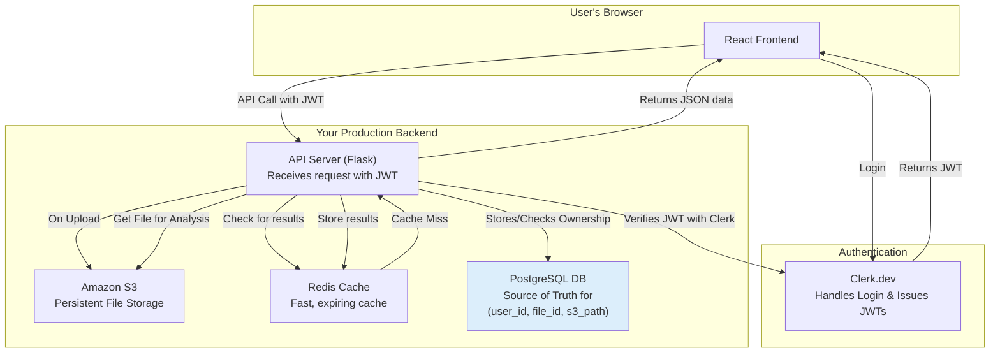

# Production-Grade Secure Workflow

This document outlines an evolved architecture for the WHOOP Extended application, designed to be secure, scalable, and persistent, making it suitable for a production environment. It addresses the limitations of the current demo-oriented design by introducing a dedicated database, object storage, a persistent cache, and a robust authentication system.

---

## The Role of Each Component

The new architecture introduces four key components that work together to create a robust system.

### 1. Amazon S3 for File Storage
-   **Replaces:** The local `/uploads` directory.
-   **Why:**
    -   **Persistence:** Files are not lost if the server restarts or crashes.
    -   **Scalability:** Multiple API servers can access the same central file store.
    -   **Decoupling:** The API server's role is computation, not long-term file storage.

### 2. Redis for Caching
-   **Replaces:** The in-memory Python dictionary (`cache = {}`).
-   **Why:**
    -   **Persistence:** The analysis cache survives API server restarts.
    -   **Scalability:** All API instances can share a single, external cache.
    -   **Advanced Features:** Redis allows setting a **TTL (Time To Live)** on cached items, so they automatically expire after a set period (e.g., 24 hours), preventing stale data.

### 3. JWTs (via Clerk) for Authentication
-   **Replaces:** The open API where knowing the `fileId` is enough for access.
-   **Why:** To perform **authentication**—proving who a user is. A JSON Web Token (JWT) acts as a secure ID card for every API request.

### 4. PostgreSQL (via Supabase) for Authorization
-   **This is the most critical new component.** It acts as the **source of truth** for the entire system.
-   **Why:** To perform **authorization**—determining what a user is allowed to see and do. This database connects the user's identity (from the JWT) to their specific data (files in S3, analysis in Redis).

---

## The LYNCHPIN: The Database as the Source of Truth

The PostgreSQL database is the component that makes the whole system work "safely." S3 is just a file cabinet, Redis is just a notepad, and Clerk is just an ID card issuer. The database holds the "permission slips" that connect them all.

A central `user_files` table is the key:

| `file_id` (Primary Key) | `user_id` (from Clerk) | `s3_storage_path` | `created_at` |
| :--- | :--- | :--- | :--- |
| `abc-123` | `user_xyz` | `uploads/user_xyz/abc-123.csv` | `2024-06-20` |
| `def-456` | `user_xyz` | `uploads/user_xyz/def-456.csv` | `2024-06-21` |
| `ghi-789` | `user_pqr` | `uploads/user_pqr/ghi-789.csv` | `2024-06-22` |

Every API request that touches data must first consult this table to ensure the authenticated user has permission to access the requested resource.

---

## New Secure Data Flow

1.  **Authentication:** The user logs into the React frontend using Clerk, which returns a JWT. This token is attached to all subsequent API calls.

2.  **File Upload:**
    -   The Flask API receives the file and the JWT.
    -   It validates the JWT with Clerk to get the `user_id`.
    -   It uploads the file to a user-specific path in S3 (e.g., `uploads/{user_id}/{file_id}.csv`).
    -   It creates a new record in the PostgreSQL database, linking the `user_id` to the `file_id` and its S3 path.

3.  **Analysis & Data Retrieval:**
    -   The API receives a request for a `file_id`, along with the JWT.
    -   It validates the JWT to get the `user_id`.
    -   **Authorization Check:** The API queries the database to confirm that this `user_id` actually owns the requested `file_id`. If not, it immediately returns a `403 Forbidden` error.
    -   If the user is authorized, the API then checks Redis for a cached result.
    -   If a result exists in the cache, it's returned instantly.
    -   If not, the API retrieves the file from S3, performs the analysis, and stores the new result in Redis (with a TTL) before returning it to the user.

---

## New Architecture Diagram

This diagram illustrates the flow of information between the user, the authentication service, and the production-grade backend components.

