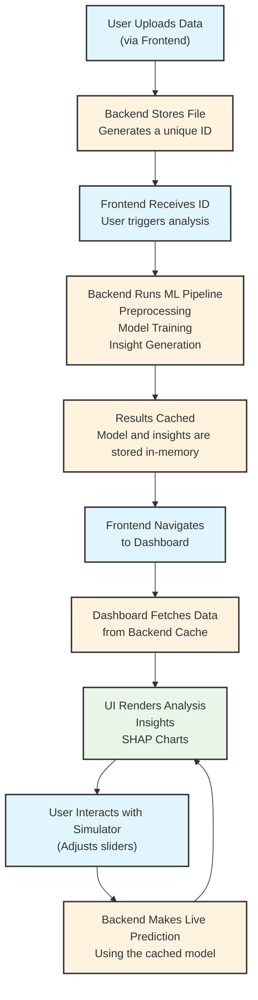

# Simplified System Flow Diagram

This diagram provides a high-level overview of the application's core workflow, from data upload to interactive analysis, condensed into about 10 key steps.

```mermaid
graph TD
    A["User Uploads Data<br/>(via Frontend)"] --> B["Backend Stores File<br/>Generates a unique ID"]
    B --> C["Frontend Receives ID<br/>User triggers analysis"]
    C --> D["Backend Runs ML Pipeline<br/>Preprocessing<br/>Model Training<br/>Insight Generation"]
    D --> E["Results Cached<br/>Model and insights are stored in-memory"]
    E --> F["Frontend Navigates<br/>to Dashboard"]
    F --> G["Dashboard Fetches Data<br/>from Backend Cache"]
    G --> H["UI Renders Analysis<br/>Insights<br/>SHAP Charts"]
    H --> I["User Interacts with Simulator<br/>(Adjusts sliders)"]
    I --> J["Backend Makes Live Prediction<br/>Using the cached model"]
    J --> H

    %% Styling to differentiate Frontend and Backend steps
    style A fill:#e1f5fe,stroke:#333,stroke-width:2px
    style C fill:#e1f5fe,stroke:#333,stroke-width:2px
    style F fill:#e1f5fe,stroke:#333,stroke-width:2px
    style H fill:#e8f5e8,stroke:#333,stroke-width:2px
    style I fill:#e1f5fe,stroke:#333,stroke-width:2px

    style B fill:#fff3e0,stroke:#333,stroke-width:2px
    style D fill:#fff3e0,stroke:#333,stroke-width:2px
    style E fill:#fff3e0,stroke:#333,stroke-width:2px
    style G fill:#fff3e0,stroke:#333,stroke-width:2px
    style J fill:#fff3e0,stroke:#333,stroke-width:2px
```