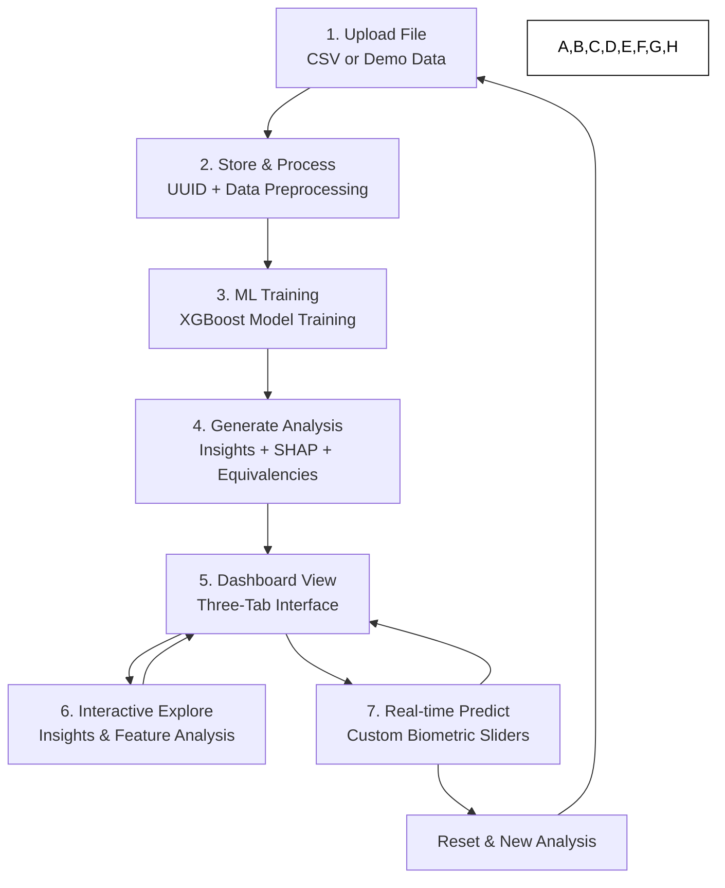

# Simplified Flow Diagram (7 Nodes)

This diagram presents the essential user journey through WHOOP Extended, distilled into 7 key nodes that capture the core functionality and value proposition.

## Core Flow Breakdown

### **1. Upload File**
- **User Action**: Select WHOOP CSV or demo data
- **System**: File validation and UUID generation
- **Key APIs**: `POST /api/upload`, `GET /api/demo`

### **2. Store & Process**
- **System**: Save file, begin data preprocessing
- **Operations**: Clean data, filter sleep duration, engineer features
- **Output**: Model-ready dataset

### **3. ML Training**
- **System**: Train XGBoost regression model
- **Process**: 5-fold cross-validation with early stopping
- **Target**: Predict Recovery Score % from biometric data

### **4. Generate Analysis**
- **System**: Create comprehensive analysis suite
- **Components**: 
  - Recovery insights (top 3 features)
  - Feature equivalency calculations
  - SHAP interpretability analysis

### **5. Dashboard View**
- **User Interface**: Three-tab analysis dashboard
- **Tabs**: Insights, Feature Analysis, Simulate
- **Data**: Parallel loading from cached analysis results

### **6. Interactive Explore**
- **User Action**: Navigate insights and visualizations
- **Features**: 
  - Carousel of recovery recommendations
  - SHAP bar charts and waterfall plots
  - Feature importance rankings

### **7. Real-time Predict**
- **User Action**: Adjust 13 biometric sliders
- **System**: Live model inference
- **Output**: Predicted recovery score with instant feedback

## Key Characteristics

### **Linear Core Flow** (Nodes 1-5)
- **Sequential Process**: Each step depends on the previous
- **One-time Setup**: Analysis generated once per dataset
- **Cached Results**: Fast subsequent access

### **Interactive Loop** (Nodes 5-7)
- **User Exploration**: Non-linear navigation between features
- **Real-time Processing**: Instant slider predictions
- **Session Continuity**: Persistent analysis state

### **Reset Capability**
- **Fresh Start**: Clear session and return to upload
- **New Analysis**: Process different dataset
- **Clean State**: Remove cached data

## Value Proposition Highlights

### **Data Input** → **ML Insights** → **Interactive Experience**
1. **Effortless Upload**: CSV or demo in one click
2. **Automated Analysis**: ML training without user intervention  
3. **Rich Insights**: Multi-dimensional analysis delivery
4. **Interactive Control**: Real-time prediction capabilities

This simplified flow emphasizes the **core user value**: transforming raw WHOOP data into actionable insights through machine learning, with an intuitive interface for exploration and experimentation. 