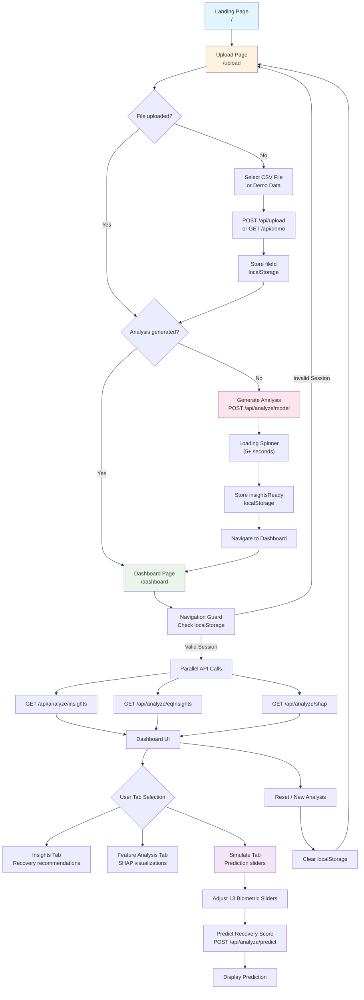

# User Flow Diagram

This diagram shows the complete user journey through the WHOOP Extended application, including all frontend interactions and navigation flows.

## Key User Interactions

### 1. Initial Navigation
- **Landing Page**: Welcome screen with "Get Started" button
- **Upload Page**: File upload interface with demo option
- **Dashboard**: Main analysis interface with three tabs

### 2. File Processing Flow
- **Upload**: User selects CSV file or demo data
- **Storage**: File ID stored in localStorage for session management
- **Analysis**: ML model training triggered by user action
- **Navigation**: Automatic redirect to dashboard when complete

### 3. Dashboard Interactions
- **Tab Navigation**: Switch between Insights, Feature Analysis, and Simulate
- **Real-time Prediction**: Interactive sliders for custom predictions
- **Session Management**: Reset functionality to start new analysis

### 4. State Management
- **localStorage**: Persistent session data (`fileId`, `insightsReady`)
- **Navigation Guards**: Automatic redirects based on session state
- **Error Handling**: Graceful fallbacks for failed API calls 